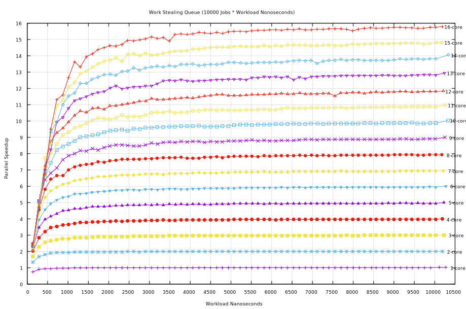

# Work Stealing Queue

This is an implementation of a Work Stealing Queue described in a series of
[blog articles](https://blog.molecular-matters.com) by [Stefan
Reinalter](https://twitter.com/molecularmusing) at Molecular Matters, beginning
with [Job System
2.0](https://blog.molecular-matters.com/2015/08/24/job-system-2-0-lock-free-work-stealing-part-1-basics/).

## Origin

In the blog article, Stefan uses a lock-free structure with memory barriers and
compare-exchange primitives.  This algorithm also uses these ideas, but does so
in a slightly different way then described by Stefan.  It dispenses with the
memory barriers and uses compare-exchange with exchange primitives to schedule
jobs using a [Work Stealing
Queue](https://stackoverflow.com/questions/27830691/work-stealing-and-deques)
which is probably taught in many CS classes like [CSE P 506 -
Concurrency](https://courses.cs.washington.edu/courses/csep506/11sp/Home.html).

## Description of Algorithm

A Work Stealing Queue is a double ended queue that each thread/core maintains.
The thread which owns the queue puts jobs at the bottom end of the queue and
other threads to steal jobs from the top end, when they have nothing to do in
their own queues.

```console
+--------+ <- entries[ 0 ]
|  top   | <- stealers consume here: job = entries[ top++ ]
|        |
|   ||   |
|        |
|   vv   |
| bottom | <- owner pushes here:    entries[ bottom++ ] = job
|        |    owner consumes here:  job = entries[ --bottom ]
|        |
+--------+ <- entries[ MASK_JOBS ]
```

The parallelism obtained by this lock-free structure is fine grained.  The test
included is able to schedule synthetic jobs with approximately 100 ns (per
thread) of overhead on my <b>i9-7960X</b> cpu.  I surmise that most of the this
is due to the cache coherency overhead of the x86 <b>cmpxchg</b> and
<b>xchg</b> instructions along with push/pop mechanics of the queue.

I measure this 100 ns overhead by putting jobs into the queue with only one
worker thread.

```console
$ git clone https://injinj.github.com/WSQ
$ cd WSQ
$ g++ -Wall -Wextra -std=c++11 -O3 test_job.cpp -pthread
$ a.out -c 1
Sizeof Job Sys Ctx: 528
Sizeof Job Thread:  524352
Sizeof Job:         56
Sizeof Job Alloc:   65480
Number of threads:  1
Serial workload:    1000 iterations
Parallel workload:  10000 jobs
Workload  Serial Elapsed  Parallel Elapsed  Speedup
--------  --------------  ----------------  -------
     100          143 ns            239 ns     0.60  (- 96 / thr: 96)
     200          291 ns            384 ns     0.76  (- 93 / thr: 93)
     300          453 ns            527 ns     0.86  (- 74 / thr: 74)
     400          597 ns            653 ns     0.91  (- 56 / thr: 56)
     500          725 ns            791 ns     0.92  (- 66 / thr: 66)
^C
$ a.out -c 2                                                            
...
Workload  Serial Elapsed  Parallel Elapsed  Speedup
--------  --------------  ----------------  -------
     100          143 ns            233 ns     0.61  (- 90 / thr: 45)
     200          289 ns            268 ns     1.08
     300          432 ns            322 ns     1.34
     400          598 ns            390 ns     1.53
     500          725 ns            457 ns     1.59
^C
$ a.out -c 3
...
Workload  Serial Elapsed  Parallel Elapsed  Speedup
--------  --------------  ----------------  -------
     100          147 ns            408 ns     0.36  (- 261 / thr: 87)
     200          287 ns            296 ns     0.97  (- 9 / thr: 3)
     300          433 ns            301 ns     1.44
     400          581 ns            326 ns     1.78
     500          724 ns            347 ns     2.09
^C
$ a.out -c 4
...
Workload  Serial Elapsed  Parallel Elapsed  Speedup
--------  --------------  ----------------  -------
     100          142 ns            417 ns     0.34  (- 275 / thr: 68)
     200          287 ns            391 ns     0.73  (- 104 / thr: 26)
     300          436 ns            360 ns     1.21
     400          583 ns            295 ns     1.98
     500          744 ns            314 ns     2.37
^C
```

I also created a gnuplot script to graph the speedup of this synthetic
workload.  This graph is the result of running that.

```console
$ gnuplot
Terminal type set to 'qt'
gnuplot> load "plot.gnuplot"
1-core
2-core
3-core
4-core
5-core
6-core
7-core
8-core
9-core
10-core
11-core
12-core
13-core
14-core
15-core
16-core
```




